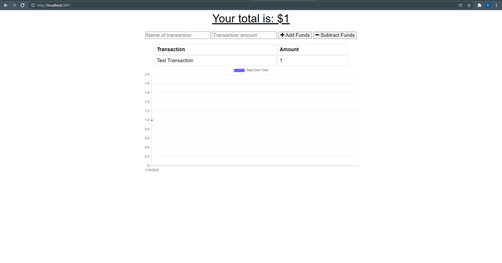

# Budget Tracker

## About: 
Budget Tracker is a Progressive Web Application that allows users to monitor transactions over time.  The tracker can also be accessed and used even without an internet connection.

## Built With: 
* HTML
* CSS 
* JavaScript 
* IndexedDB 
* Express.js 
* MongoDB 

## Website/ Links: 

